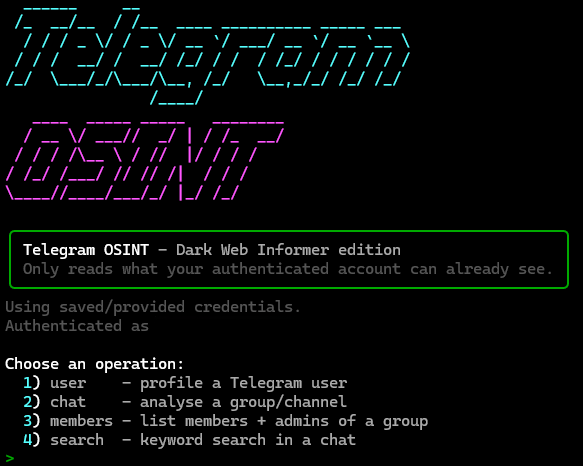

# Telegram OSINT

> Dark Web Informer edition

A single-file, terminal-based OSINT toolkit for Telegram, built on [Telethon](https://github.com/LonamiWebs/Telethon) and [Rich](https://github.com/Textualize/rich). It profiles users, analyses groups and channels, enumerates members, and searches chat history, then exports everything to JSON, CSV, or Markdown.

It **only reads what your authenticated account can already see.** No exploits, no private-data scraping, no access-control bypass - every operation goes through the standard Telegram API using your own session.

<p>
  
  
  
</p>

<p align="center">
  
</p>

---

## ⚠️ Responsible use

This tool is intended for **legitimate research, threat intelligence, journalism, trust & safety, and security work** on data you are lawfully permitted to access.

- You are responsible for complying with Telegram's [Terms of Service](https://telegram.org/tos) and API terms.
- Processing personal data may be regulated in your jurisdiction (e.g. GDPR, CCPA). Make sure you have a lawful basis.
- Do **not** use this to stalk, harass, dox, or surveil individuals.

Use it on your own accounts, on communities you have authorisation to investigate, or on genuinely public sources. The maintainers accept no liability for misuse.

---

## Features

### `user` - profile a Telegram user
- Core profile: usernames (including secondary handles), display name, numeric ID, bio, birthday, phone (when visible), language, data center, and the `premium` / `verified` / `bot` / `scam` / `fake` / `restricted` flags.
- **Account-age estimate** interpolated from the user ID against known ID/date anchors.
- Business and bot metadata: business address/location/hours, bot description, privacy-policy URL, and command list.
- **Shared groups & channels** you have in common with the target.
- Optional **behavioural profile**: scans the target's messages across your shared groups to surface top words, shared domains, hashtags, mentions, forward sources, media types, and activity by hour/weekday.
- **Timezone estimate** inferred from posting-activity troughs (with a confidence level).
- **Profile-photo history** archiving with a first-seen → last-seen timeline.
- **Pivots**: other `@handles`, `t.me` links, and social-media links pulled from the bio for the next hop.

### `chat` - analyse a group or channel
- Metadata: title, description, member count, verified/scam flags, data center, and linked discussion group.
- Message analytics: top posters, forward sources, shared domains, hashtags, mentions, common words, media breakdown, and activity sparklines.
- Pinned-message extraction and pivot links.

### `members` - list members & admins
- Enumerates the roster (username, name, ID, phone when visible, bot/premium flags, online status) up to 50,000 entries.
- Highlights the **creator and admins** with their custom ranks.

### `search` - keyword search in a chat
- Server-side keyword search across a chat's history, with date windowing.

### Invite previews
- Pass a private invite link (`t.me/+…` or `t.me/joinchat/…`) to preview the title, description, member count, and any sample members Telegram exposes - **without joining**.

### Across all modes
- **Date windowing** with `--since` / `--until` (UTC).
- **Export** to `json`, `csv`, and/or `md`.
- Interactive menu **or** fully scriptable CLI arguments.
- Polished Rich terminal UI, automatic dependency bootstrap, and flood-wait handling.

---

## Requirements

- Python **3.10+**
- Telegram API credentials (free) - create an app at <https://my.telegram.org/auth>

Dependencies install automatically on first run. To install them manually:

```bash
pip install -r requirements.txt    # required: telethon + rich
pip install pyfiglet cryptg        # optional: ASCII banner + faster downloads
```

---

## Installation

```bash
git clone https://github.com/darkwebinformer/telegram-osint.git
cd telegram-osint
python telegram_osint.py
```

The script is self-contained - no build step required.

---

## Configuration

On first run you'll be prompted for your **API ID**, **API hash**, and a **session name**. You can optionally save them to `config.json` (written with `chmod 600`).

Credentials are resolved in this order:

1. CLI flags: `--api-id`, `--api-hash`, `--session`
2. Environment variables: `TG_API_ID`, `TG_API_HASH`, `TG_SESSION`
3. `config.json` in the working directory
4. Interactive prompt

```bash
export TG_API_ID=123456
export TG_API_HASH=abcdef0123456789abcdef0123456789
export TG_SESSION=tg
```

> Keep `config.json` and your `.session` file private - the session grants access to your account.

---

## Usage

### Interactive mode

Just run the script and follow the menu:

```bash
python telegram_osint.py
```

### CLI mode

```bash
# Profile a user (no message scan)
python telegram_osint.py user @durov

# Profile a user, scan up to 200 of their messages per shared group, export everything
python telegram_osint.py user @durov --messages 200 --export json,csv,md

# Analyse the last 5,000 messages of a channel
python telegram_osint.py chat @telegram --limit 5000 --export md

# Enumerate every member of a group and export to CSV
python telegram_osint.py members https://t.me/somegroup --limit 0 --export csv

# Keyword-search a chat within a date window
python telegram_osint.py search @somechat "ransomware" --since 2024-01-01 --until 2024-06-01

# Preview a private invite without joining
python telegram_osint.py chat "https://t.me/+AbCdEfGhIjK"
```

Targets can be an `@username`, a numeric ID, a `t.me/...` link, a `t.me/c/...` link, or an invite link.

### Options

| Flag | Description |
|------|-------------|
| `command` | `user`, `chat`, `members`, or `search` (omit for the interactive menu) |
| `target` | `@username`, numeric ID, `t.me` link, or invite link |
| `keyword` | search term (`search` command only) |
| `--api-id` | Telegram API ID |
| `--api-hash` | Telegram API hash |
| `--session` | Telethon session name |
| `--limit N` | messages to scan (`chat`/`search`) or members to fetch (`members`); `0` = all, up to 50k |
| `--messages N` | `user`: messages to scan per shared group (`0` = none, `-1` = all) |
| `--since` | only messages on/after `YYYY-MM-DD[ HH:MM]` (UTC) |
| `--until` | only messages before `YYYY-MM-DD[ HH:MM]` (UTC) |
| `--photos` | download the target's profile-photo history (`user`/`chat`) |
| `--export` | comma list of formats: `json`, `csv`, `md` |
| `--no-clear` | don't clear the screen on launch |
| `--once` | run one operation and exit instead of looping |

---

## Output

Exports are written to `./exports/` with timestamped filenames, for example:

```
exports/
├── durov_user_20260116-142233.json
├── durov_user_20260116-142233.csv
├── durov_user_20260116-142233.md
└── photos/
    └── durov/
        ├── 000.jpg
        └── 001.jpg
```

- **JSON** - the full structured result (best for tooling and pivoting).
- **CSV** - flattened rows (messages for `user`/`chat`/`search`, roster for `members`).
- **Markdown** - a readable investigation report.

---

## How some of the analysis works

- **Account-age estimate** - Telegram user IDs increase roughly monotonically over time, so the tool interpolates a creation date from the ID against a table of known anchors. It's approximate and labelled as such.
- **Timezone inference** - it finds the quietest 6-hour window in a target's posting activity (a proxy for sleep), maps that to a likely UTC offset, and reports a confidence level based on sample size and how pronounced the trough is.
- **Pivots** - bios, descriptions, and pinned messages are scanned for other handles, `t.me` links, and known social-media domains to suggest the next investigative hop.

---

## Notes & limitations

- Everything is bounded by what your account can see. Private channels you haven't joined, hidden member lists, and users who restrict their data will return little or nothing.
- Telegram rate-limits aggressive requests; the tool sleeps through flood-waits automatically, so large enumerations can take a while.
- Estimates (account age, timezone) are heuristics, not ground truth - treat them as leads, not facts.

---

## License

Released under the MIT License. See [`LICENSE`](LICENSE) for details.
